# README.md

태그: 배포

# 동또농 🏀

- AI 영상 분석 기술을 통한 농구 전력 분석 서비스

## 1️⃣ 프로젝트 개요

### 🗓️ **프로젝트 일정**

> 2023.08.28 ~ 2023.10.06 (6주)

### ✨ **서비스 한 줄 소개**

> **동**네에서 **또** **농**구 🏀
> 아마추어 농구인들을 위한 AI 농구 전력 분석 서비스

### 💭 **기획 배경**

- **점수 계산**

  > **💬** 몇 점이었더라?

  공수 전환이 빠른 농구의 특성 상 게임에 몰입하다 보면 현재 스코어를 제대로 기억하는 경우가 드물다. 점수를 계산하다가 경기의 흐름이 끊기는 경우도 많다. 이제는 점수 신경 쓰지 말고 경기에 온전히 집중하자!

- **전력 분석 시스템의 부재**

  > 🤔 실력이 늘지 않는 거 같아…

  프로 농구와 달리 혼자, 친구와, 동호회에서 농구를 하는 아마추어들은 자신의 농구 역량을 파악하기 어렵다. 전문 장비가 있는 것도 아니고 전력 분석관이 따로 있는 것도 아닌 아마추어 농구인들을 위한 전력 분석 시스템이 필요하다!

- **하이라이트 생성.. 귀찮아!**

  > 👀 봤어?

  골이 들어가는 짜릿한 순간!을 오래오래 기억하고 자랑하고 싶은 우리.. 농구 영상을 찍어놓고 나중에 편집하려고 보면 슛 시도 구간이 너무 많아 내가 언제 골을 넣었는지 슛 구간을 찾는 것도 일! 찾아서 일일이 편집하는 것도 일! 자동으로 하이라이트를 생성해주는 서비스느 없을까?

### 💘 **주요 타겟층**

- 나의 농구 역량을 확인하고 싶은 농구인!
- 하이라이트 영상을 통해 골을 넣는 나의 모습을 기억하고 싶은 농구인!

## 2️⃣ 주요 기능 및 서비스 화면

### 🤳 **주요 기능**

- **AI 영상 분석 🔍**

  슛 시도 횟수와 슛 성공 여부를 판별하여 슛 성공률 확인

- **전력 데이터 분석 📊**

  AI 영상 분석 데이터를 기반으로 개인의 농구 역량 분석

- **나만의 하이라이트 생성 📺**

  AI를 통한 슛 구간 편집 및 자동 하이라이트 생성

### 💻 **서비스 화면**

🏡 **메인 화면**

> 동또농의 메인 페이지입니다. 서비스의 정체성 및 이용 가이드를 확인할 수 있습니다.

- 농구의 역동성을 느낄 수 있는 `라인아트`를 적용하여 동또농의 정체성을 느낄 수 있습니다.
- 각 모드 별 설명 및 간단한 촬영 가이드를 확인할 수 있습니다.

  

**🔑 로그인 화면**

> 유저들의 접근성을 위하여 `카카오톡 소셜 로그인`을 구현하였습니다.

- 메인 화면을 제외한 서비스를 이용하기 위해서는 로그인이 요구됩니다.

**웹**

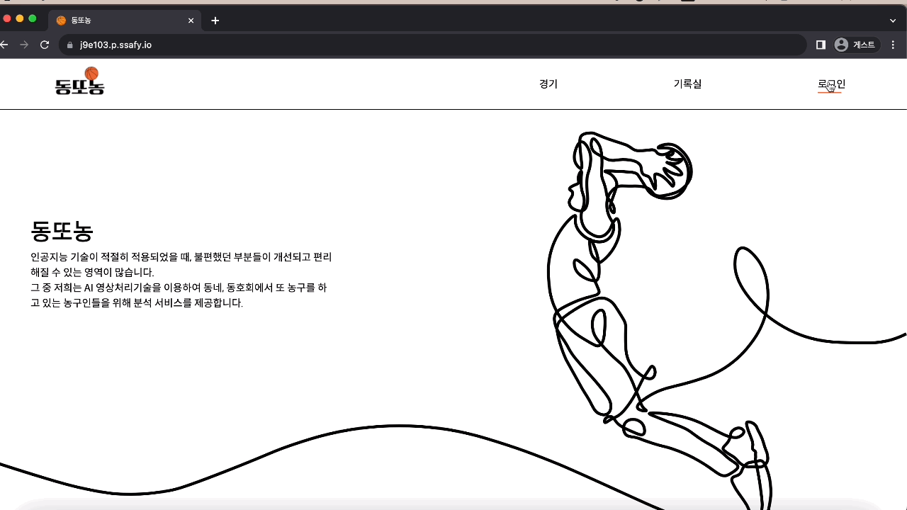

**모바일**


**↖️ 영상 업로드**

> AI 분석을 위한 영상을 업로드하기 위한 모달입니다. 업로드 이후 영상 분석 진행 상황을 확인할 수 있습니다.

- 분석하고 싶은 영상을 선택하고 `경기 모드`를 선택한 후 업로드합니다.

웹


모바일


- 분석 중인 영상과 분석 완료된 영상 목록을 확인할 수 있습니다.

웹


모바일


**🤼 경기 화면**

> 나의 경기 기록을 캘린더와 목록을 통해 한눈에 확인할 수 있습니다.

- 월 별로 진행한 경기의 개수를 확인할 수 있습니다.
- 해당 날짜의 경기 목록을 조회할 수 있습니다.

웹


모바일

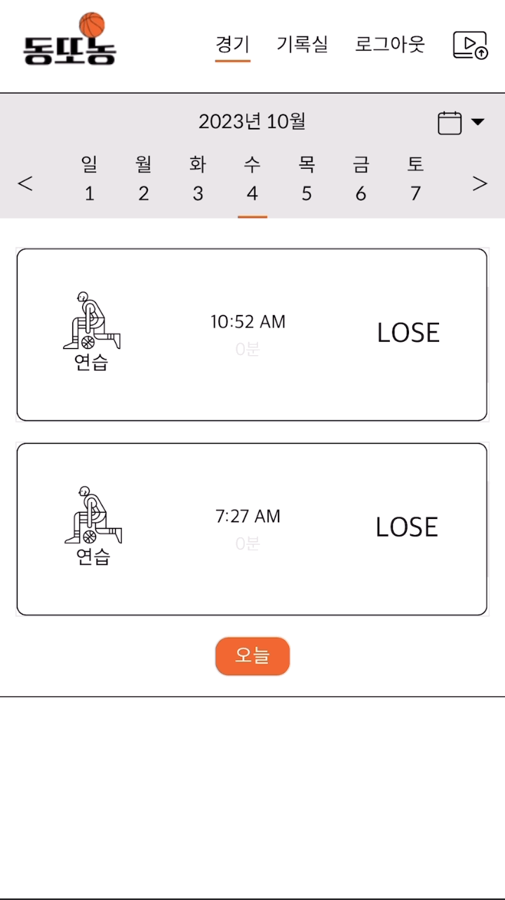

- 해당 경기의 상세 기록을 확인할 수 있습니다.

웹


모바일


**💽 기록실 화면**

> 해당 유저의 전체 경기 데이터 분석 결과를 확인할 수 있습니다.

- 유저의 프로필과 전체 통계를 확인할 수 있습니다.
- 경기 모드 별 전체 기록을 한눈에 확인할 수 있습니다.

<!-- 웹


모바일

 -->

<div style="display: flex; align-items: center;">
  
  
</div>

**⚡ 하이라이트 영상**

> AI를 통해 자동으로 생성된 하이라이트 영상입니다.

- 해당 경기에 관련된 하이라이트 영상을 볼 수 있습니다.
- 공유하기 기능을 통해 하이라이트를 공유 및 저장할 수 있습니다.

웹


모바일


## 3️⃣ 기술 스택

### 💻 Front-end

- React
- tailwindCSS
- contextAPI

### 💻 Back-end

- springboot
- java
- spring data
- JPA

### 🤖 AI

- python
- flask
- uwsgi
- YOLO 7 → 객체 인식 (학습 : 사람, 공, 골대)
- DeepSort → 객체 추적
- BlazePose → 자세 추정 (키포인트)

### 💾 DB

- MariaDB
- mongoDB

### ⚙CI/CD

- nginx
- Jenkins
- Docker
- EC2
- S3
- **상세 기술스택 및 버전**

| 구분 | 기술 스택         | 상세 내용 | 버전        |
| ---- | ----------------- | --------- | ----------- |
| BE   | java              |           | 17          |
|      | Springboot        |           | 3.0.1       |
|      | jUnit             |           | 5           |
|      | gradle            |           | 7.6         |
|      | swagger           |           | 3           |
|      | mariaDB           |           | 10.11.1 RC  |
| FE   | Node              |           | 18.17.1 LTS |
|      | React             |           | 18.2.0      |
|      | React-router-dom: |           | 6.16.0      |
|      | Axios             |           | 1.5.0       |
|      | TailwindCSS       |           | 3.3.3       |
| AI   | python            |           | 3.8         |
|      | torch             |           | 1.11.0      |
|      | torchvision       |           | 0.12.0      |

## 4️⃣ 프로젝트 구조

### 📂 Front-end

```
📂src
  ├─📂api
  ├─📂assets
    │  ├─📂font
  │  └─📂icon
  ├─📂components
  │  ├─📂Chart
  │  ├─📂Game
  │  ├─📂Home
  │  ├─📂Login
  │  ├─📂Modal
  │  ├─📂Recordroom
  │  ├─📂Status
  │  └─📂UploadModal
  ├─📂contexts
  └─📂pages
       ├─📂Game
     ├─📂Home
     └─📂Recordroom
```

### 📂 Back-end

```
📂src
 └─📂main
    ├─📂java
    │  └─📂com
    │      └─📂dongddonong
    │          ├─📂config
    │          ├─📂controller
    │          ├─📂dto
    │          │  ├─📂game
    │          │  ├─📂token
    │          │  ├─📂upload
    │          │  └─📂user
    │          ├─📂model
    │          │  ├─📂game
    │          │  ├─📂token
    │          │  └─📂user
    │          ├─📂service
    │          └─📂util
    └─📂resources
         └─📂static/images
```

## 5️⃣ 산출물

### **⚙ 시스템 아키텍처**

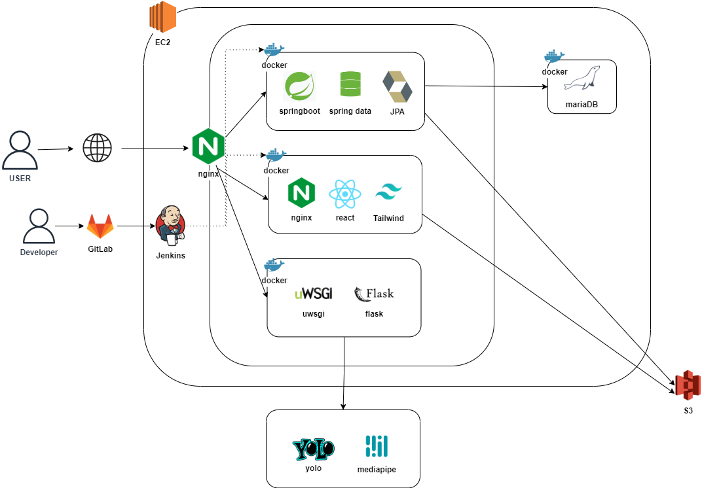

### **💾 ERD 다이어그램**

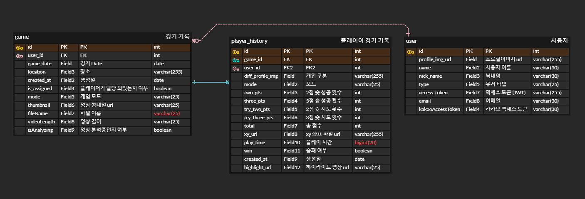

### 🤲 요구사항 정의서

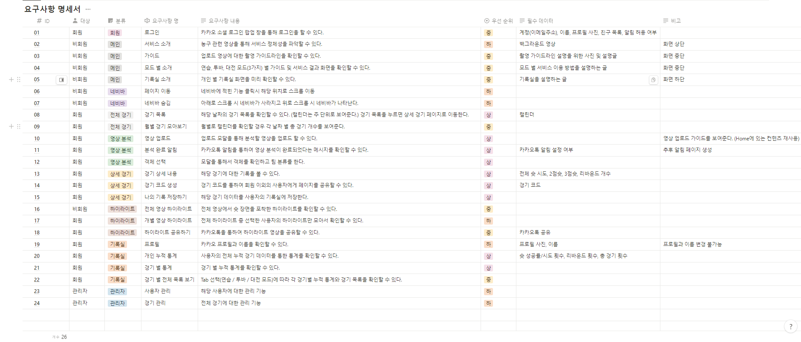

### **🔊 API 명세서**

### 🎨 디자인 시안 ([Figma 🖇️](https://www.figma.com/file/uGVsl70R0oVdoCVBYwFVmK/%EB%8F%99%EB%98%90%EB%86%8D%F0%9F%8F%80?type=design&node-id=206%3A349&mode=design&t=pR5Jzre7PEO8sL9i-1))

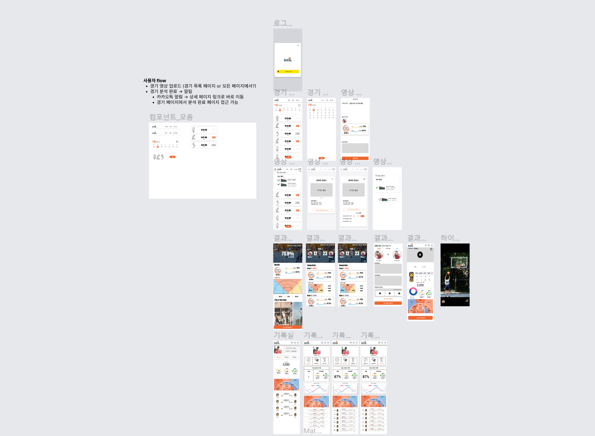

### 🗒️ 협업관리

**📉 JIRA - 에자일한 개발 일정 관리**
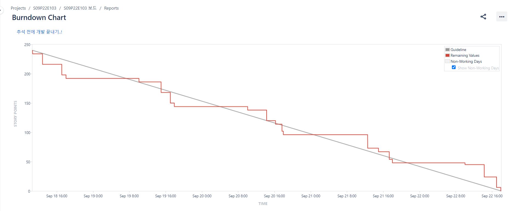

**⏳ Gitlab - Gitflow 및 이슈 관리를 통한 커밋 컨벤션**
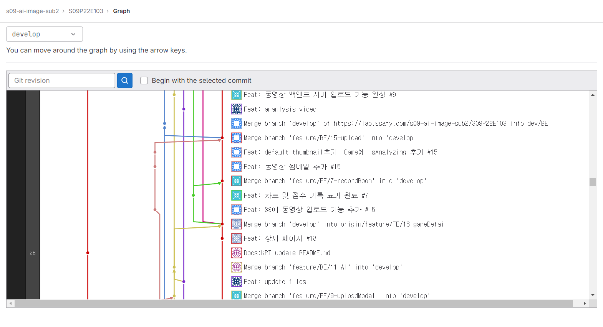

**🗒️ Notion - 협업 및 프로젝트 문서 관리**
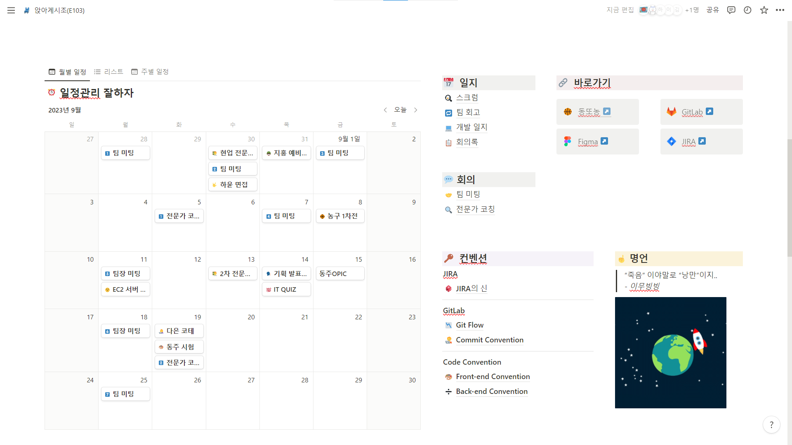
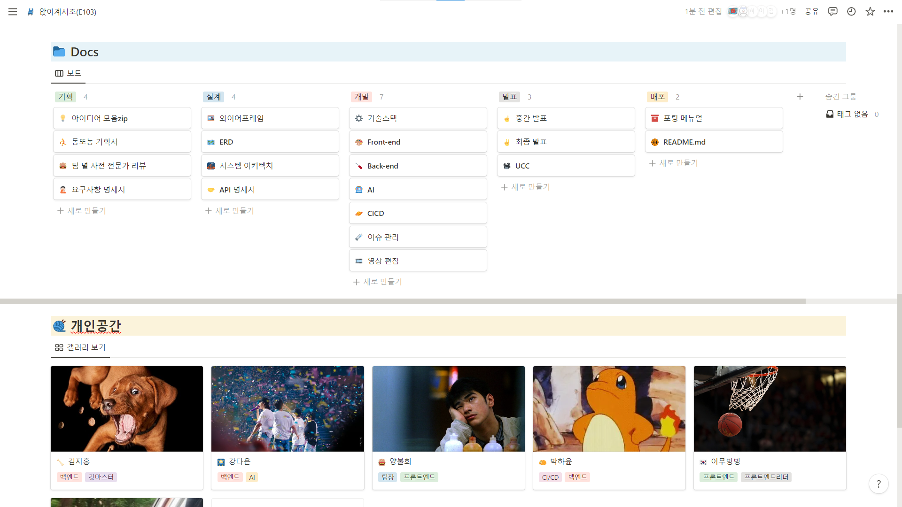

**🍳 오전 스크럼 및 KPT 회고를 통한 일정 관리**

**스크럼**
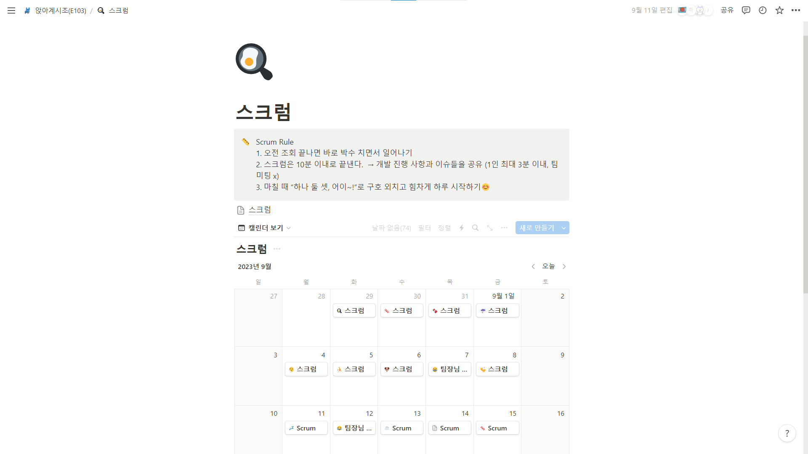

**KPT 회고**
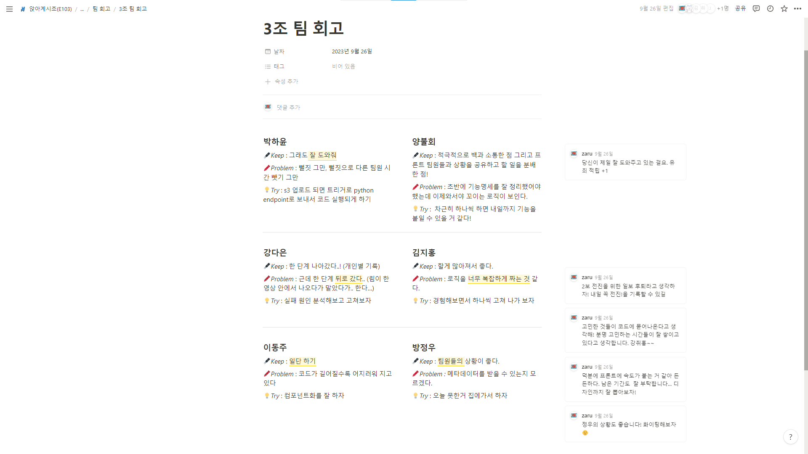

## 6️⃣ 포팅 메뉴얼

## 7️⃣ 팀원 소개

| 프로필 사진 |        |           |        |        |     |
| ----------- | ------ | --------- | ------ | ------ | --- |
| 강다은      | 김지홍 | 박하윤    | 방정우 | 양불회 |     |
| (팀장)      | 이동주 |           |        |        |     |
| AI          | BE     | CI/CD, BE | FE     | FE     | FE  |
